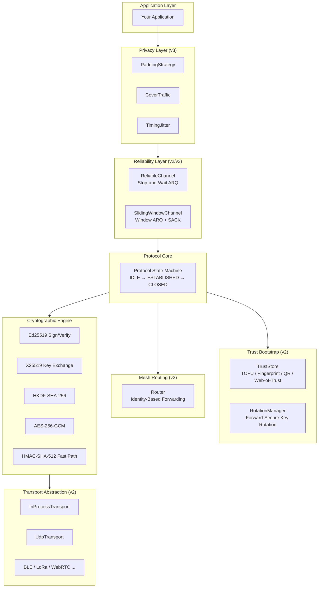
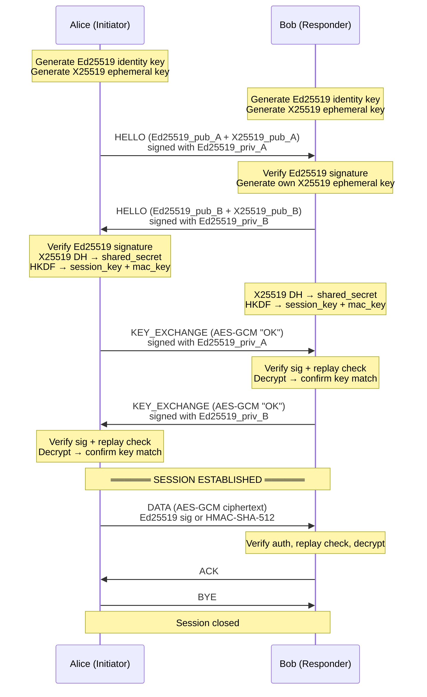
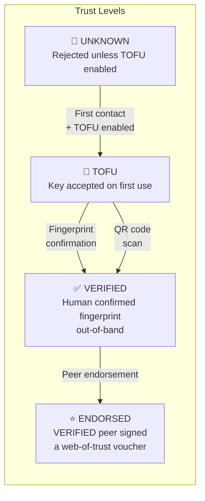
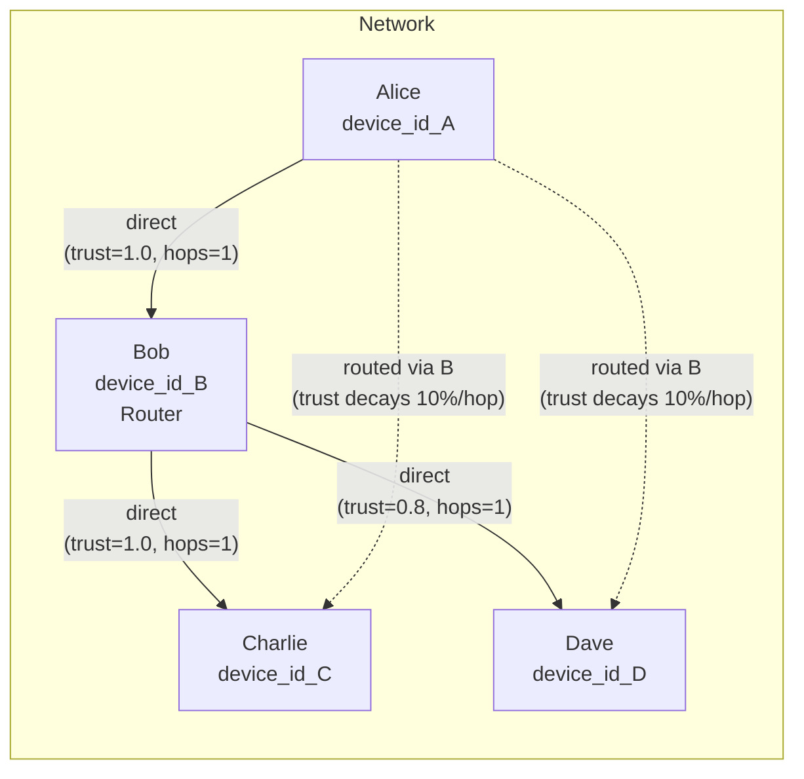
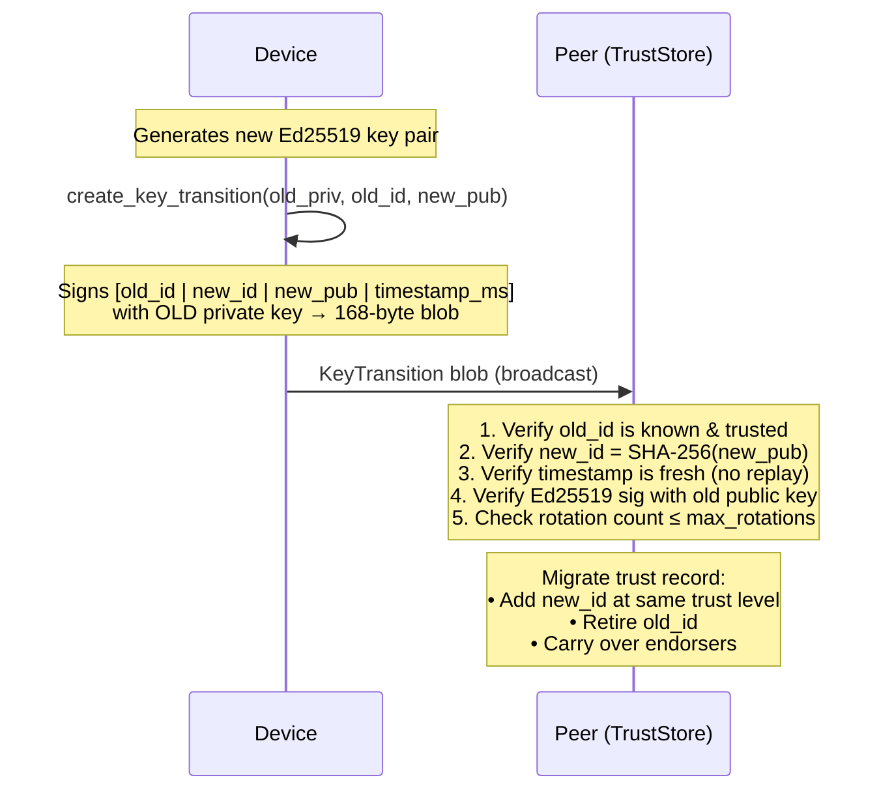
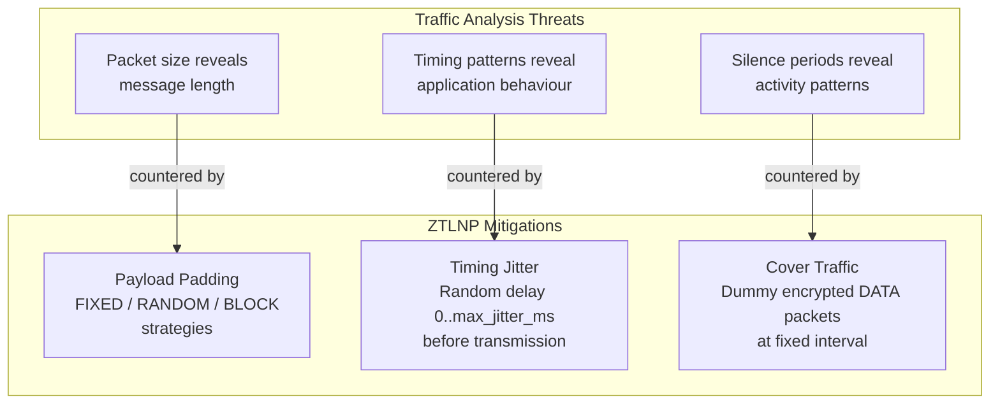

# ZTLNP — Zero-Trust Local Network Protocol


> **Authenticate every packet. Trust nothing by default — not even your own LAN.**

Traditional TCP/IP implicitly trusts everything on the local network. ZTLNP
redesigns that assumption from the ground up: every device proves its
cryptographic identity on every packet it sends, payloads are encrypted
end-to-end, and the protocol runs over any physical medium without modification.

---

## Architecture Overview



---

## Features at a Glance

| # | Feature | Mechanism | Version |
|---|---------|-----------|---------|
| 🔐 | **Per-packet authentication** | Ed25519 signature or HMAC-SHA-512 fast path | v1 |
| 🔒 | **Payload confidentiality** | AES-256-GCM authenticated encryption | v1 |
| 🛡️ | **Replay-attack prevention** | Timestamp bounds (±30 s) + sequence-number window | v1 |
| 🪪 | **Cryptographic identity** | SHA-256(Ed25519 pub key) — not IP or MAC | v1 |
| 🤝 | **Forward secrecy** | X25519 ephemeral key exchange per session | v1 |
| 🌱 | **Trust bootstrap** | TOFU → fingerprint → QR → web-of-trust endorsements | v2 |
| 🌐 | **Transport agnostic** | Runs over UDP, in-process, BLE, LoRa, WebRTC, … | v2 |
| 🕸️ | **Mesh routing** | Identity-based forwarding, trust-weighted route selection | v2 |
| 📦 | **Reliable delivery (S&W)** | Stop-and-wait ARQ with exponential-backoff retransmission | v2 |
| ⚡ | **MAC optimization** | HMAC-SHA-512 DATA path replaces Ed25519 (~4–40× faster) | v2 |
| 🔑 | **Key rotation** | Forward-secure identity rotation with signed transitions | v3 |
| 🚀 | **Sliding-window ARQ** | Window-based ARQ + SACK for high-throughput bulk transfer | v3 |
| 👁️ | **Traffic analysis resistance** | Payload padding, timing jitter, cover traffic | v3 |

---

## Packet Wire Format

Every ZTLNP packet shares a fixed-length header. All multi-byte integers are **big-endian**.

```
┌──────────────────────────────────────────────────────────────────┐
│                        ZTLNP Packet                              │
├────────┬──────┬─────────────────────────────────────────────────┤
│ Offset │  Len │ Field                                            │
├────────┼──────┼─────────────────────────────────────────────────┤
│      0 │    4 │ Magic            b"ZTLP"                         │
│      4 │    1 │ Version          0x01                            │
│      5 │    1 │ Type             HELLO=0x01  KEY_EXCHANGE=0x02   │
│        │      │                  DATA=0x03   ACK=0x04            │
│        │      │                  ERROR=0x05  BYE=0x06            │
│        │      │                  ROUTE_ANNOUNCE=0x07             │
│        │      │                  TRUST_ENDORSE=0x08              │
│      6 │    2 │ Flags            bit 0: ENCRYPTED                │
│        │      │                  bit 1: BROADCAST                │
│        │      │                  bit 2: MAC_AUTH (HMAC-SHA-512)  │
│      8 │   32 │ Sender ID        SHA-256(Ed25519 pub key)        │
│     40 │   32 │ Recipient ID     SHA-256(Ed25519 pub key)        │
│     72 │    8 │ Timestamp        Unix milliseconds (uint64)      │
│     80 │    4 │ Sequence Number  monotonically increasing        │
│     84 │   12 │ Nonce            AES-256-GCM nonce (random)      │
│     96 │    4 │ Payload Length   bytes that follow               │
│    100 │    N │ Payload          AES-256-GCM ciphertext          │
│        │      │                  (plaintext for HELLO)           │
│  100+N │   64 │ Signature        Ed25519 over bytes [0..100+N)   │
│        │      │                  or HMAC-SHA-512 (MAC_AUTH flag) │
└────────┴──────┴─────────────────────────────────────────────────┘
```

> **HELLO** packets carry an **unencrypted** `[32 B Ed25519 pub][32 B X25519 pub]` payload so peers can bootstrap a shared secret. Every other packet type carries an **encrypted** payload.

---

## Handshake Flow



---

## Trust Bootstrap



| Method | How it works |
|--------|-------------|
| **TOFU** | Accept unknown key on first contact; store for future verification |
| **Fingerprint** | `SHA-256(pub_key)` displayed as `A1B2:C3D4:…` (8 × 4 hex groups) — read aloud over a phone call |
| **QR code** | `ZTLNP:1:<device_id_hex>:<pub_hex>:<fingerprint_hex>` — scan to bootstrap VERIFIED trust instantly |
| **Web-of-trust** | 160-byte endorsement blob signed by a VERIFIED peer; any `TrustStore` can verify it |

---

## Mesh Routing



- Routes are keyed by **device identity** (not IP address)
- Best route: `score = trust_score / (hop_count × latency_ms)`
- `ROUTE_ANNOUNCE` packets flood reachability; trust decays 10% per hop
- Final recipient verifies the **original sender's** Ed25519 signature directly

---

## Forward-Secure Key Rotation (v3)



---

## Traffic Analysis Resistance (v3)



---

## Reliability: Stop-and-Wait vs Sliding Window

```
Stop-and-Wait ARQ (ReliableChannel):
  ┌──────┐          ┌──────┐
  │Alice │          │ Bob  │
  └──┬───┘          └───┬──┘
     │── DATA[seq=1] ──►│
     │                  │ (process)
     │◄─── ACK[1] ──────│
     │── DATA[seq=2] ──►│
     ...
  Throughput ≈ payload_size / RTT

Sliding-Window ARQ (SlidingWindowChannel) with SACK:
  ┌──────┐          ┌──────┐
  │Alice │          │ Bob  │
  └──┬───┘          └───┬──┘
     │── DATA[1] ──────►│
     │── DATA[2] ──────►│
     │── DATA[3] ──────►│  (window=3)
     │── DATA[4] ──────►│
     │◄── SACK[cum=4] ──│
     │── DATA[5] ──────►│
     ...
  Throughput ≈ window_size × payload_size / RTT  (up to 64× faster)
```

---

## Cryptographic Algorithms

| Purpose | Algorithm | Library |
|---------|-----------|---------|
| Identity / signing | Ed25519 | `cryptography` |
| Key agreement | X25519 | `cryptography` |
| Session key derivation | HKDF-SHA-256 | `cryptography` |
| MAC key derivation | HKDF-SHA-256 (separate `info` string) | `cryptography` |
| Payload encryption | AES-256-GCM | `cryptography` |
| Fast packet MAC | HMAC-SHA-512 | `cryptography` |

---

## Installation

```bash
pip install -r requirements.txt
```

**Requirements:** Python 3.9+, `cryptography >= 46.0.6`

---

## Quick Start

### Basic Handshake and Data Exchange

```python
from ztlnp.device import Device
from ztlnp.protocol import Protocol, ProtocolState

alice_dev = Device("Alice")
bob_dev   = Device("Bob")

alice = Protocol(alice_dev)
bob   = Protocol(bob_dev)

# Handshake (4 messages)
hello1 = alice.initiate(bob_dev.device_id)   # Alice → Bob HELLO
hello2 = bob.process_incoming(hello1)        # Bob   → Alice HELLO
ke1    = alice.process_incoming(hello2)      # Alice → Bob KEY_EXCHANGE
ke2    = bob.process_incoming(ke1)           # Bob   → Alice KEY_EXCHANGE
alice.process_incoming(ke2)                  # Alice confirms

assert alice.state == ProtocolState.ESTABLISHED
assert bob.state   == ProtocolState.ESTABLISHED

# Data exchange
wire      = alice.send_data(b"zero-trust message")
plaintext = bob.receive_data(wire)
assert plaintext == b"zero-trust message"
```

### Trust Bootstrap

```python
from ztlnp.trust import TrustStore, TrustLevel, fingerprint_of, encode_qr_payload

store = TrustStore(allow_tofu=True)

# TOFU — accept on first contact
store.process_hello(bob_dev.device_id, bob_dev.identity_public_bytes)

# Confirm fingerprint out-of-band (phone call, QR scan, etc.)
fp = fingerprint_of(bob_dev.identity_public_bytes)
print(f"Bob's fingerprint: {fp}")   # e.g. "A1B2:C3D4:E5F6:…"
store.verify_fingerprint(bob_dev.device_id, fp)

# QR-code bootstrap (VERIFIED trust instantly)
qr = encode_qr_payload(charlie_dev.device_id, charlie_dev.identity_public_bytes)
device_id, pub = parse_qr_payload(qr)
store.add(pub, TrustLevel.VERIFIED)
```

### Sliding-Window High-Throughput Transfer (v3)

```python
from ztlnp.sliding_window import SlidingWindowChannel, SackFrame

channel = SlidingWindowChannel(protocol, window_size=64)

# Send (up to window_size packets in flight simultaneously)
seq, wire = channel.send(b"bulk data chunk")
if wire:
    transport.send(peer_addr, wire)

# Periodically retransmit overdue packets
for wire in channel.get_retransmissions():
    transport.send(peer_addr, wire)

# Receive a SACK ACK from the peer
sack = SackFrame.decode(device.decrypt_packet(ack_packet))
channel.process_sack(sack)
```

### Key Rotation (v3)

```python
from ztlnp.identity import create_key_transition, RotationManager

# Device rotates its identity key
transition = device.rotate_key()           # returns a KeyTransition blob

# Peer applies the transition
rotation_mgr = RotationManager(trust_store)
rotation_mgr.apply_transition(transition)  # validates and migrates trust
```

### Traffic Analysis Resistance (v3)

```python
from ztlnp.privacy import PaddingStrategy, pad_to_size, jitter_sleep, CoverTraffic

# Pad payload before encryption
padded, was_padded = pad_to_size(plaintext, PaddingStrategy.BLOCK, block_size=64)

# Random send delay
jitter_sleep(max_jitter_ms=50)

# Cover traffic (keeps observed packet rate constant)
cover = CoverTraffic(protocol, interval_ms=500)
# In a timer callback:
dummy_packet = cover.maybe_send()
if dummy_packet:
    transport.send(peer_addr, dummy_packet)
```

Run the full end-to-end demo:

```bash
python example.py
```

---

## Running Tests

```bash
pip install pytest
pytest tests/ -v
```

---

## Project Structure

```
ZTLNP/
│
├── ztlnp/                     Python package
│   ├── __init__.py            Public API re-exports
│   │
│   │   ── Core ──────────────────────────────────────────────────────
│   ├── packet.py              Wire-format (Packet, PacketType, PacketFlags)
│   ├── crypto.py              CryptoEngine (Ed25519, X25519, HKDF, AES-GCM, HMAC)
│   ├── device.py              Device — identity, sessions, packet builders
│   ├── session.py             Session — keys, sequence tracking, replay window
│   ├── protocol.py            Protocol — state machine (IDLE → ESTABLISHED → CLOSED)
│   ├── exceptions.py          Custom exception hierarchy
│   │
│   │   ── v2 Features ──────────────────────────────────────────────
│   ├── trust.py               Trust bootstrap (TOFU, fingerprint, QR, web-of-trust)
│   ├── transport.py           Transport ABC, InProcessTransport, UdpTransport
│   ├── router.py              Router, RouteTable, RouteEntry (mesh routing)
│   ├── reliability.py         ReliableChannel (stop-and-wait ARQ)
│   │
│   │   ── v3 Features ──────────────────────────────────────────────
│   ├── identity.py            KeyTransition, RotationManager (key rotation)
│   ├── sliding_window.py      SlidingWindowChannel, SackFrame (high-throughput ARQ)
│   └── privacy.py             PaddingStrategy, CoverTraffic, jitter (traffic analysis)
│
├── tests/
│   ├── test_packet.py         Packet serialisation, wire layout, error paths
│   ├── test_crypto.py         Cryptographic primitive unit tests
│   ├── test_protocol.py       Handshake, data exchange, security properties
│   ├── test_trust.py          Trust bootstrap: TOFU, fingerprint, QR, web-of-trust
│   ├── test_transport.py      InProcessTransport and UdpTransport
│   ├── test_router.py         RouteTable, Router, mesh routing, announcements
│   └── test_reliability.py    ReliableChannel ARQ, retransmission, MAC optimization
│
├── example.py                 End-to-end demo covering all features
├── requirements.txt           Python dependencies
└── SPEC.md                    Formal protocol specification
```

---

## Why This Matters

Traditional TCP/IP networks assume that **anything already on the LAN is
trustworthy**. An attacker who gains access to the local segment can intercept
or inject traffic freely. ZTLNP removes every one of those assumptions:

| Attack | ZTLNP defence |
|--------|--------------|
| ARP / IP spoofing | Identity is a cryptographic key, not an IP or MAC address |
| Packet injection | Every packet carries an unforgeable Ed25519 signature or HMAC-SHA-512 tag |
| Replay attacks | Timestamp (±30 s) + per-session sequence-number window reject re-delivered packets |
| Passive eavesdropping | AES-256-GCM provides confidentiality against any observer on the LAN |
| Man-in-the-middle at first contact | TOFU, QR verification, and web-of-trust endorsements solve key distribution |
| Traffic fingerprinting | Payload padding, timing jitter, and cover traffic obscure message size, timing, and activity patterns |
| Long-term key compromise | Forward-secure key rotation lets a device publicly commit to a new key, preserving the old trust chain |
| Mesh route poisoning | Trust caps, endorsement depth limits, and route-poisoning defences in the Router |
