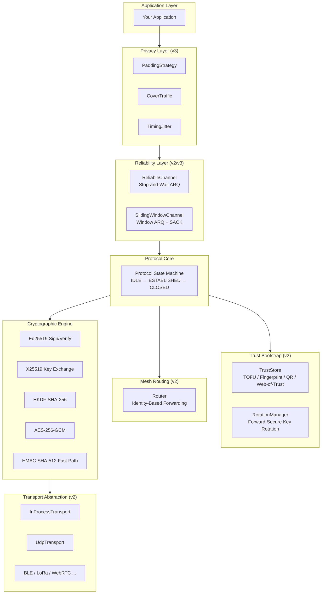
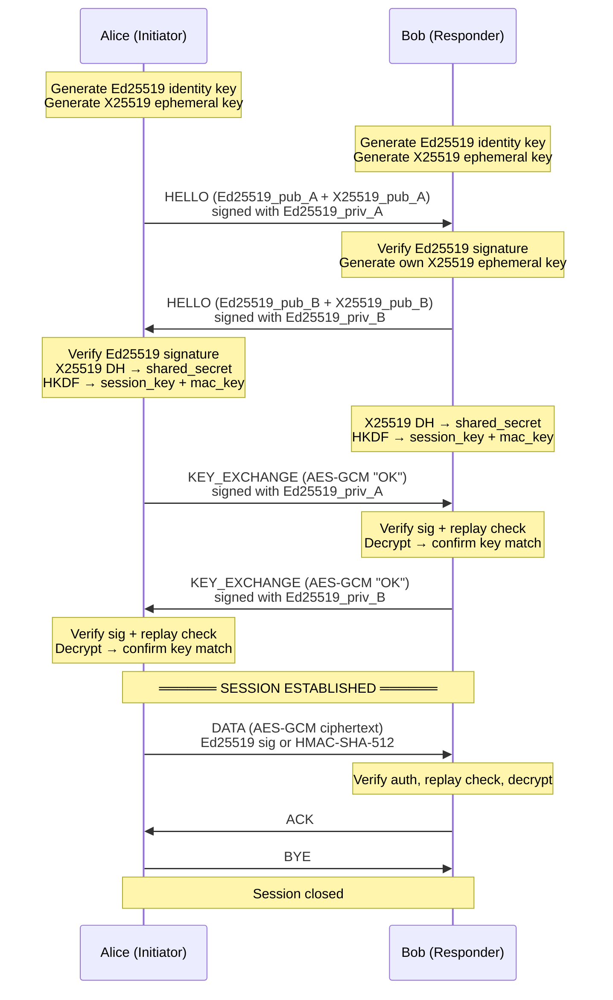
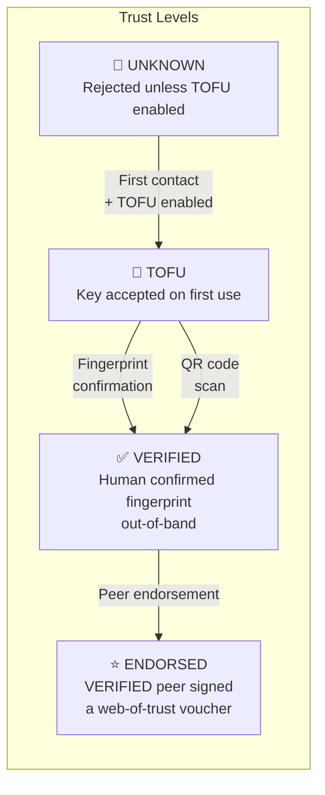
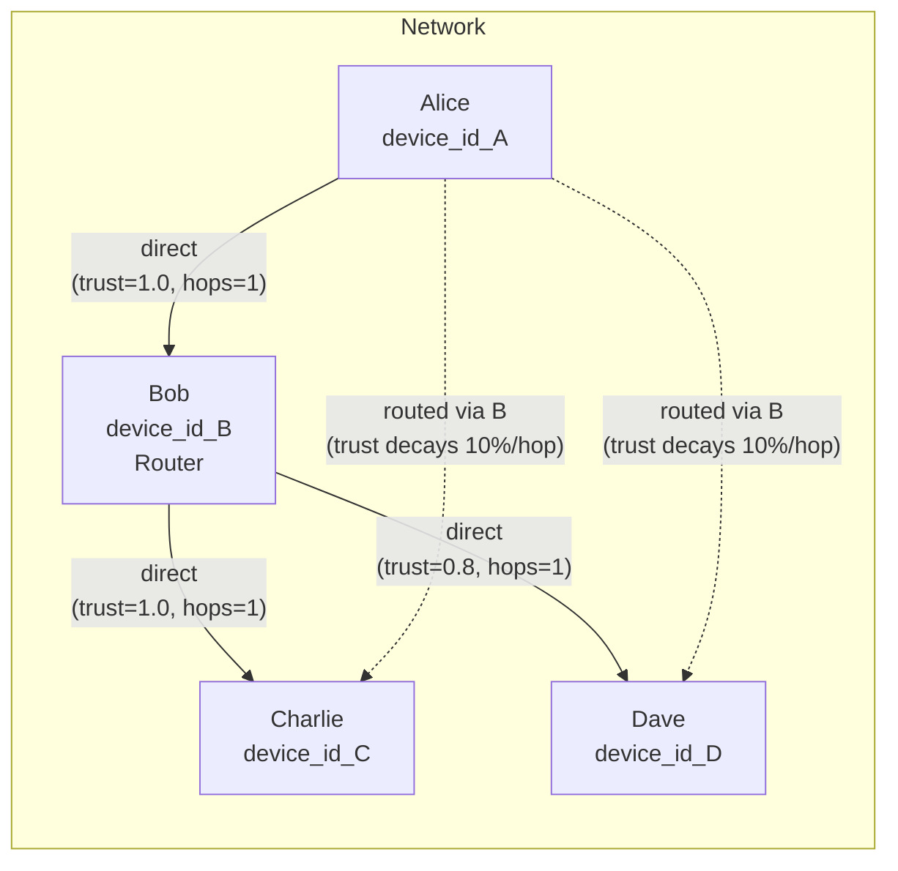
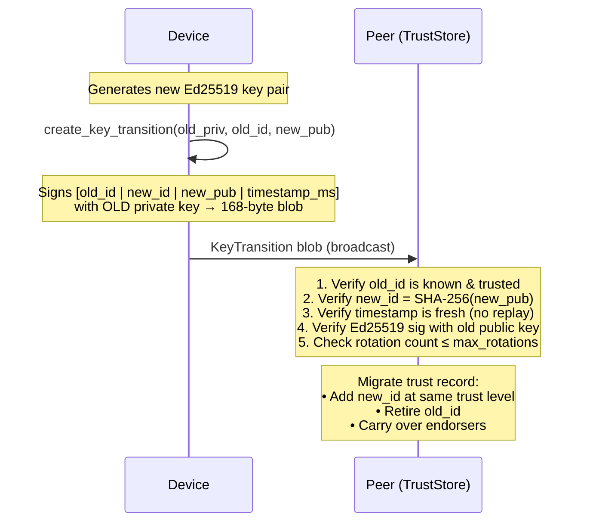
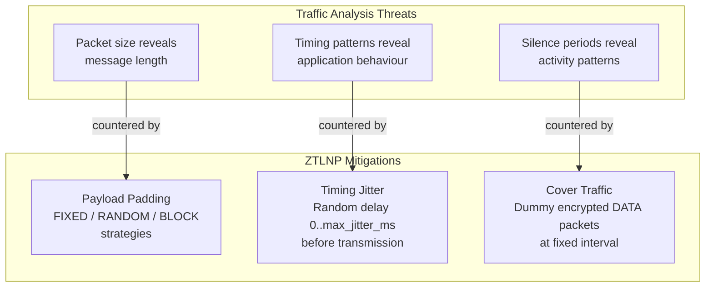

# ZTLNP — Zero-Trust Local Network Protocol

<div align="center">

```
███████╗████████╗██╗     ███╗   ██╗██████╗
╚══███╔╝╚══██╔══╝██║     ████╗  ██║██╔══██╗
  ███╔╝    ██║   ██║     ██╔██╗ ██║██████╔╝
 ███╔╝     ██║   ██║     ██║╚██╗██║██╔═══╝
███████╗   ██║   ███████╗██║ ╚████║██║
╚══════╝   ╚═╝   ╚══════╝╚═╝  ╚═══╝╚═╝

  Zero-Trust Local Network Protocol  ·  v3
  ─────────────────────────────────────────
  Authenticate every packet.
  Trust nothing by default — not even your own LAN.
```


**Designed, engineered, and documented by [Daniel Kimeu](#-credits--author)**

</div>

---

Traditional TCP/IP implicitly trusts everything on the local network. ZTLNP
redesigns that assumption from the ground up: every device proves its
cryptographic identity on every packet it sends, payloads are encrypted
end-to-end, and the protocol runs over any physical medium without modification.

---

## Table of Contents

1. [Architecture Overview](#architecture-overview)
2. [Features at a Glance](#features-at-a-glance)
3. [Packet Wire Format](#packet-wire-format)
4. [Handshake Flow](#handshake-flow)
5. [Trust Bootstrap](#trust-bootstrap)
6. [Mesh Routing](#mesh-routing)
7. [Forward-Secure Key Rotation (v3)](#forward-secure-key-rotation-v3)
8. [Traffic Analysis Resistance (v3)](#traffic-analysis-resistance-v3)
9. [Reliability: Stop-and-Wait vs Sliding Window](#reliability-stop-and-wait-vs-sliding-window)
10. [Cryptographic Algorithms](#cryptographic-algorithms)
11. [Performance Benchmarks](#performance-benchmarks)
12. [Installation](#installation)
13. [Quick Start](#quick-start)
14. [Running Tests](#running-tests)
15. [Project Structure](#project-structure)
16. [Why This Matters](#why-this-matters)
17. [Credits & Author](#-credits--author)

---

## Architecture Overview



---

## Features at a Glance

| # | Feature | Mechanism | Version |
|---|---------|-----------|---------|
| 🔐 | **Per-packet authentication** | Ed25519 signature or HMAC-SHA-512 fast path | v1 |
| 🔒 | **Payload confidentiality** | AES-256-GCM authenticated encryption | v1 |
| 🛡️ | **Replay-attack prevention** | Timestamp bounds (±30 s) + sequence-number window | v1 |
| 🪪 | **Cryptographic identity** | SHA-256(Ed25519 pub key) — not IP or MAC | v1 |
| 🤝 | **Forward secrecy** | X25519 ephemeral key exchange per session | v1 |
| 🌱 | **Trust bootstrap** | TOFU → fingerprint → QR → web-of-trust endorsements | v2 |
| 🌐 | **Transport agnostic** | Runs over UDP, in-process, BLE, LoRa, WebRTC, … | v2 |
| 🕸️ | **Mesh routing** | Identity-based forwarding, trust-weighted route selection | v2 |
| 📦 | **Reliable delivery (S&W)** | Stop-and-wait ARQ with exponential-backoff retransmission | v2 |
| ⚡ | **MAC optimization** | HMAC-SHA-512 DATA path replaces Ed25519 (~4–40× faster) | v2 |
| 🔑 | **Key rotation** | Forward-secure identity rotation with signed transitions | v3 |
| 🚀 | **Sliding-window ARQ** | Window-based ARQ + SACK for high-throughput bulk transfer | v3 |
| 👁️ | **Traffic analysis resistance** | Payload padding, timing jitter, cover traffic | v3 |

---

## Packet Wire Format

Every ZTLNP packet shares a fixed-length header. All multi-byte integers are **big-endian**.

```
┌──────────────────────────────────────────────────────────────────┐
│                        ZTLNP Packet                              │
├────────┬──────┬─────────────────────────────────────────────────┤
│ Offset │  Len │ Field                                            │
├────────┼──────┼─────────────────────────────────────────────────┤
│      0 │    4 │ Magic            b"ZTLP"                         │
│      4 │    1 │ Version          0x01                            │
│      5 │    1 │ Type             HELLO=0x01  KEY_EXCHANGE=0x02   │
│        │      │                  DATA=0x03   ACK=0x04            │
│        │      │                  ERROR=0x05  BYE=0x06            │
│        │      │                  ROUTE_ANNOUNCE=0x07             │
│        │      │                  TRUST_ENDORSE=0x08              │
│      6 │    2 │ Flags            bit 0: ENCRYPTED                │
│        │      │                  bit 1: BROADCAST                │
│        │      │                  bit 2: MAC_AUTH (HMAC-SHA-512)  │
│      8 │   32 │ Sender ID        SHA-256(Ed25519 pub key)        │
│     40 │   32 │ Recipient ID     SHA-256(Ed25519 pub key)        │
│     72 │    8 │ Timestamp        Unix milliseconds (uint64)      │
│     80 │    4 │ Sequence Number  monotonically increasing        │
│     84 │   12 │ Nonce            AES-256-GCM nonce (random)      │
│     96 │    4 │ Payload Length   bytes that follow               │
│    100 │    N │ Payload          AES-256-GCM ciphertext          │
│        │      │                  (plaintext for HELLO)           │
│  100+N │   64 │ Signature        Ed25519 over bytes [0..100+N)   │
│        │      │                  or HMAC-SHA-512 (MAC_AUTH flag) │
└────────┴──────┴─────────────────────────────────────────────────┘
```

> **HELLO** packets carry an **unencrypted** `[32 B Ed25519 pub][32 B X25519 pub]` payload so peers can bootstrap a shared secret. Every other packet type carries an **encrypted** payload.

---

## Handshake Flow



---

## Trust Bootstrap



| Method | How it works |
|--------|-------------|
| **TOFU** | Accept unknown key on first contact; store for future verification |
| **Fingerprint** | `SHA-256(pub_key)` displayed as `A1B2:C3D4:…` (8 × 4 hex groups) — read aloud over a phone call |
| **QR code** | `ZTLNP:1:<device_id_hex>:<pub_hex>:<fingerprint_hex>` — scan to bootstrap VERIFIED trust instantly |
| **Web-of-trust** | 160-byte endorsement blob signed by a VERIFIED peer; any `TrustStore` can verify it |

---

## Mesh Routing



- Routes are keyed by **device identity** (not IP address)
- Best route: `score = trust_score / (hop_count × latency_ms)`
- `ROUTE_ANNOUNCE` packets flood reachability; trust decays 10% per hop
- Final recipient verifies the **original sender's** Ed25519 signature directly

---

## Forward-Secure Key Rotation (v3)



---

## Traffic Analysis Resistance (v3)



---

## Reliability: Stop-and-Wait vs Sliding Window

```
Stop-and-Wait ARQ (ReliableChannel):
  ┌──────┐          ┌──────┐
  │Alice │          │ Bob  │
  └──┬───┘          └───┬──┘
     │── DATA[seq=1] ──►│
     │                  │ (process)
     │◄─── ACK[1] ──────│
     │── DATA[seq=2] ──►│
     ...
  Throughput ≈ payload_size / RTT

Sliding-Window ARQ (SlidingWindowChannel) with SACK:
  ┌──────┐          ┌──────┐
  │Alice │          │ Bob  │
  └──┬───┘          └───┬──┘
     │── DATA[1] ──────►│
     │── DATA[2] ──────►│
     │── DATA[3] ──────►│  (window=3)
     │── DATA[4] ──────►│
     │◄── SACK[cum=4] ──│
     │── DATA[5] ──────►│
     ...
  Throughput ≈ window_size × payload_size / RTT  (up to 64× faster)
```

---

## Cryptographic Algorithms

| Purpose | Algorithm | Library |
|---------|-----------|---------|
| Identity / signing | Ed25519 | `cryptography` |
| Key agreement | X25519 | `cryptography` |
| Session key derivation | HKDF-SHA-256 | `cryptography` |
| MAC key derivation | HKDF-SHA-256 (separate `info` string) | `cryptography` |
| Payload encryption | AES-256-GCM | `cryptography` |
| Fast packet MAC | HMAC-SHA-512 | `cryptography` |

---

## Installation

```bash
pip install -r requirements.txt
```

**Requirements:** Python 3.9+, `cryptography >= 46.0.6`

---

## Quick Start

### Basic Handshake and Data Exchange

```python
from ztlnp.device import Device
from ztlnp.protocol import Protocol, ProtocolState

alice_dev = Device("Alice")
bob_dev   = Device("Bob")

alice = Protocol(alice_dev)
bob   = Protocol(bob_dev)

# Handshake (4 messages)
hello1 = alice.initiate(bob_dev.device_id)   # Alice → Bob HELLO
hello2 = bob.process_incoming(hello1)        # Bob   → Alice HELLO
ke1    = alice.process_incoming(hello2)      # Alice → Bob KEY_EXCHANGE
ke2    = bob.process_incoming(ke1)           # Bob   → Alice KEY_EXCHANGE
alice.process_incoming(ke2)                  # Alice confirms

assert alice.state == ProtocolState.ESTABLISHED
assert bob.state   == ProtocolState.ESTABLISHED

# Data exchange
wire      = alice.send_data(b"zero-trust message")
plaintext = bob.receive_data(wire)
assert plaintext == b"zero-trust message"
```

### Trust Bootstrap

```python
from ztlnp.trust import TrustStore, TrustLevel, fingerprint_of, encode_qr_payload

store = TrustStore(allow_tofu=True)

# TOFU — accept on first contact
store.process_hello(bob_dev.device_id, bob_dev.identity_public_bytes)

# Confirm fingerprint out-of-band (phone call, QR scan, etc.)
fp = fingerprint_of(bob_dev.identity_public_bytes)
print(f"Bob's fingerprint: {fp}")   # e.g. "A1B2:C3D4:E5F6:…"
store.verify_fingerprint(bob_dev.device_id, fp)

# QR-code bootstrap (VERIFIED trust instantly)
qr = encode_qr_payload(charlie_dev.device_id, charlie_dev.identity_public_bytes)
device_id, pub = parse_qr_payload(qr)
store.add(pub, TrustLevel.VERIFIED)
```

### Sliding-Window High-Throughput Transfer (v3)

```python
from ztlnp.sliding_window import SlidingWindowChannel, SackFrame

channel = SlidingWindowChannel(protocol, window_size=64)

# Send (up to window_size packets in flight simultaneously)
seq, wire = channel.send(b"bulk data chunk")
if wire:
    transport.send(peer_addr, wire)

# Periodically retransmit overdue packets
for wire in channel.get_retransmissions():
    transport.send(peer_addr, wire)

# Receive a SACK ACK from the peer
sack = SackFrame.decode(device.decrypt_packet(ack_packet))
channel.process_sack(sack)
```

### Key Rotation (v3)

```python
from ztlnp.identity import create_key_transition, RotationManager

# Device rotates its identity key
transition = device.rotate_key()           # returns a KeyTransition blob

# Peer applies the transition
rotation_mgr = RotationManager(trust_store)
rotation_mgr.apply_transition(transition)  # validates and migrates trust
```

### Traffic Analysis Resistance (v3)

```python
from ztlnp.privacy import PaddingStrategy, pad_to_size, jitter_sleep, CoverTraffic

# Pad payload before encryption
padded, was_padded = pad_to_size(plaintext, PaddingStrategy.BLOCK, block_size=64)

# Random send delay
jitter_sleep(max_jitter_ms=50)

# Cover traffic (keeps observed packet rate constant)
cover = CoverTraffic(protocol, interval_ms=500)
# In a timer callback:
dummy_packet = cover.maybe_send()
if dummy_packet:
    transport.send(peer_addr, dummy_packet)
```

Run the full end-to-end demo:

```bash
python example.py
```

---

## Performance Benchmarks

> Full methodology and analysis: [`docs/performance-benchmarks.md`](docs/performance-benchmarks.md)

### Cryptographic Primitive Latencies

| Operation | Latency (µs) | Notes |
|-----------|-------------|-------|
| Ed25519 key generation | 37 | One-time cost per device |
| Ed25519 sign | 35 | Per HELLO / KEY_EXCHANGE |
| Ed25519 verify | 111 | Per incoming packet (default path) |
| HMAC-SHA-512 compute | 3.8 | Per outgoing MAC_AUTH DATA packet |
| HMAC-SHA-512 verify | 3.7 | Per incoming MAC_AUTH DATA packet |
| X25519 DH exchange | 37 | Per handshake, per side |
| HKDF-SHA-256 | 5.3 | Key derivation |
| AES-256-GCM (1 KB) | 2.2 | Per DATA packet payload |

### End-to-End Packet Throughput

| Authentication Path | ms/packet | Packets/s |
|--------------------|-----------|-----------|
| Ed25519 (default) | 0.171 | ~5 850 |
| HMAC-SHA-512 (MAC_AUTH) | 0.024 | ~41 700 |
| **Speedup** | **7.2×** | **7.2×** |

### Reliable Channel Throughput (1 KB payload)

| Channel | RTT 1 ms | RTT 10 ms | RTT 50 ms | RTT 100 ms |
|---------|----------|-----------|-----------|------------|
| Stop-and-Wait ARQ | 1 000 KB/s | 100 KB/s | 20 KB/s | 10 KB/s |
| Sliding-Window ARQ (w=64) | 64 000 KB/s | 6 400 KB/s | 1 280 KB/s | 640 KB/s |

> A full ZTLNP handshake completes in **under 1 ms** of computation (excluding network RTT).

### Packet Size Overhead

| Plaintext (bytes) | Wire size (bytes) | Overhead ratio |
|-------------------|-------------------|----------------|
| 0 | 180 | ∞ |
| 64 | 244 | 2.81× |
| 256 | 436 | 70% |
| 1 024 | 1 204 | 17.6% |
| 4 096 | 4 276 | 4.4% |
| 65 535 | 65 715 | 0.27% |

---

## Live Terminal Demo

Run `python example.py` to see all features in action end-to-end:

```
================================================================
  Feature 1 — Trust Bootstrap Layer
================================================================

[*] First contact: Trust-on-First-Use (TOFU)
    ✓  Bob accepted via TOFU  (trust level: TOFU)

[*] Out-of-band fingerprint verification (phone call / QR scan)
    ✓  Bob's fingerprint: A1B2:C3D4:E5F6:G7H8:I9J0:K1L2:M3N4:O5P6
    ✓  Fingerprint confirmed → trust level: VERIFIED

[*] QR-code-friendly key exchange for Charlie
    ✓  QR payload: ZTLNP:1:<device_id_hex>:<pub_hex>:<fingerprint_h…
    ✓  Charlie's key loaded from QR payload → VERIFIED

[*] Web-of-trust: Alice (VERIFIED) endorses Dave
    ✓  Endorsement blob: 160 bytes (signed by Alice)
    ✓  Dave accepted via web-of-trust → trust level: ENDORSED

================================================================
  Feature 2 — Transport Abstraction
================================================================

[*] Alice ↔ Bob over InProcessTransport
    ✓  Alice local address : b'alice-addr'
    ✓  Bob   local address : b'bob-addr'
    ✓  Message delivered over InProcessTransport: 'Transport-agnostic payload'
    ✓  Same API works over UDP, BLE, LoRa, WebRTC — just swap the Transport.

================================================================
  Feature 3 — Mesh Routing (Identity-Based Forwarding)
================================================================

[*] Three nodes: Alice — Bob (router) — Charlie
[*] Alice learned 1 route(s) from Bob's announcement
[*] Alice → Bob (router) → Charlie: forwarding a DATA packet
    ✓  Charlie received: 'Routed zero-trust payload'
    ✓  Packet traversed two hops; Charlie verified Alice's Ed25519 signature directly.

================================================================
  Feature 4 — Reliable Delivery (Retransmission / ARQ)
================================================================

[*] Sending a message with ARQ tracking
    ✓  Packet queued with sequence 1; pending: 1
    ✓  ACK received for seq 1; pending: 0

[*] Simulating packet loss and retransmission
    ✓  1 retransmission generated; retry count: 1

[*] Exhausting max_retries raises RetransmitError
    ✓  RetransmitError raised as expected: max retries exceeded for seq 1

================================================================
  Feature 5 — MAC Optimization (HMAC-SHA-512 Fast Path)
================================================================

[*] Comparing Ed25519 vs HMAC-SHA-512 per-packet authentication
    ✓  Ed25519 sign+verify:     0.171 ms/packet
    ✓  HMAC-SHA-512 tag+verify: 0.024 ms/packet
    ✓  Speedup: 7.2×
    ✓  MAC_AUTH flag set on the packet
    ✓  MAC-authenticated packet decrypted and verified correctly

================================================================
  All Features Validated — ZTLNP v2 Summary
================================================================

  Feature 1 — Trust Bootstrap
    ✓ TOFU, fingerprint verification, QR key exchange
    ✓ Web-of-trust endorsements (signed vouchers from VERIFIED peers)

  Feature 2 — Transport Abstraction
    ✓ Protocol runs unchanged over InProcessTransport, UDP, or any adapter

  Feature 3 — Mesh Routing
    ✓ Packets forwarded by device identity (not IP)
    ✓ Route announcements propagate reachability; trust decays per hop

  Feature 4 — Reliability (Stop-and-Wait ARQ)
    ✓ Pending-packet queue, exponential backoff, configurable max retries
    ✓ Caller-driven (no hidden threads)

  Feature 5 — MAC Optimization
    ✓ DATA packets in established sessions use HMAC-SHA-512 (MAC_AUTH flag)
    ✓ Same wire format, same replay protection, significantly faster
```

---

## Running Tests

```bash
pip install pytest
pytest tests/ -v
```

Expected output:

```
============================= test session starts ==============================
platform linux -- Python 3.12.x, pytest-9.x.x

tests/test_packet.py::TestPacketSerialization::test_hello_packet            PASSED
tests/test_packet.py::TestWireLayout::test_field_offsets                    PASSED
tests/test_packet.py::TestPacketFlags::test_combined_flags                  PASSED
tests/test_crypto.py::TestCryptoEngine::test_ed25519_sign_verify            PASSED
tests/test_crypto.py::TestCryptoEngine::test_x25519_key_exchange            PASSED
tests/test_crypto.py::TestCryptoEngine::test_aes_gcm_encrypt_decrypt        PASSED
tests/test_crypto.py::TestCryptoEngine::test_hmac_sha512_mac                PASSED
tests/test_protocol.py::TestHandshake::test_full_four_message_handshake     PASSED
tests/test_protocol.py::TestDataExchange::test_encrypted_payload_round_trip PASSED
tests/test_protocol.py::TestSecurity::test_replay_attack_rejected           PASSED
tests/test_protocol.py::TestSecurity::test_tampered_ciphertext_rejected     PASSED
tests/test_trust.py::TestTrustStoreTOFU::test_tofu_accept_on_first_contact  PASSED
tests/test_trust.py::TestFingerprint::test_verify_fingerprint_upgrades      PASSED
tests/test_trust.py::TestQRPayload::test_encode_decode_roundtrip            PASSED
tests/test_trust.py::TestWebOfTrust::test_create_and_verify_endorsement     PASSED
tests/test_transport.py::TestInProcessTransport::test_send_recv             PASSED
tests/test_transport.py::TestUdpTransport::test_bidirectional               PASSED
tests/test_router.py::TestRouteTable::test_best_route_scoring               PASSED
tests/test_router.py::TestRouter::test_route_announce_propagation           PASSED
tests/test_reliability.py::TestReliableChannel::test_ack_clears_pending     PASSED
tests/test_reliability.py::TestReliableChannel::test_retransmit_on_timeout  PASSED
tests/test_reliability.py::TestReliableChannel::test_max_retries_raises     PASSED
...

============================== 249 passed in 0.43s ==============================
```

---

## Project Structure

```
ZTLNP/
│
├── ztlnp/                     Python package
│   ├── __init__.py            Public API re-exports
│   │
│   │   ── Core ──────────────────────────────────────────────────────
│   ├── packet.py              Wire-format (Packet, PacketType, PacketFlags)
│   ├── crypto.py              CryptoEngine (Ed25519, X25519, HKDF, AES-GCM, HMAC)
│   ├── device.py              Device — identity, sessions, packet builders
│   ├── session.py             Session — keys, sequence tracking, replay window
│   ├── protocol.py            Protocol — state machine (IDLE → ESTABLISHED → CLOSED)
│   ├── exceptions.py          Custom exception hierarchy
│   │
│   │   ── v2 Features ──────────────────────────────────────────────
│   ├── trust.py               Trust bootstrap (TOFU, fingerprint, QR, web-of-trust)
│   ├── transport.py           Transport ABC, InProcessTransport, UdpTransport
│   ├── router.py              Router, RouteTable, RouteEntry (mesh routing)
│   ├── reliability.py         ReliableChannel (stop-and-wait ARQ)
│   │
│   │   ── v3 Features ──────────────────────────────────────────────
│   ├── identity.py            KeyTransition, RotationManager (key rotation)
│   ├── sliding_window.py      SlidingWindowChannel, SackFrame (high-throughput ARQ)
│   └── privacy.py             PaddingStrategy, CoverTraffic, jitter (traffic analysis)
│
├── tests/
│   ├── test_packet.py         Packet serialisation, wire layout, error paths
│   ├── test_crypto.py         Cryptographic primitive unit tests
│   ├── test_protocol.py       Handshake, data exchange, security properties
│   ├── test_trust.py          Trust bootstrap: TOFU, fingerprint, QR, web-of-trust
│   ├── test_transport.py      InProcessTransport and UdpTransport
│   ├── test_router.py         RouteTable, Router, mesh routing, announcements
│   └── test_reliability.py    ReliableChannel ARQ, retransmission, MAC optimization
│
├── example.py                 End-to-end demo covering all features
├── requirements.txt           Python dependencies
└── SPEC.md                    Formal protocol specification
```

---

## Why This Matters

Traditional TCP/IP networks assume that **anything already on the LAN is
trustworthy**. An attacker who gains access to the local segment can intercept
or inject traffic freely. ZTLNP removes every one of those assumptions:

| Attack | ZTLNP defence |
|--------|--------------|
| ARP / IP spoofing | Identity is a cryptographic key, not an IP or MAC address |
| Packet injection | Every packet carries an unforgeable Ed25519 signature or HMAC-SHA-512 tag |
| Replay attacks | Timestamp (±30 s) + per-session sequence-number window reject re-delivered packets |
| Passive eavesdropping | AES-256-GCM provides confidentiality against any observer on the LAN |
| Man-in-the-middle at first contact | TOFU, QR verification, and web-of-trust endorsements solve key distribution |
| Traffic fingerprinting | Payload padding, timing jitter, and cover traffic obscure message size, timing, and activity patterns |
| Long-term key compromise | Forward-secure key rotation lets a device publicly commit to a new key, preserving the old trust chain |
| Mesh route poisoning | Trust caps, endorsement depth limits, and route-poisoning defences in the Router |

---

## 🙌 Credits & Author

<div align="center">

```
╔══════════════════════════════════════════════════════════════╗
║                                                              ║
║                    DANIEL  KIMEU                             ║
║                                                              ║
║         Protocol Architect · Cryptography Engineer          ║
║              Security Researcher · open-source Builder       ║
║                                                              ║
╚══════════════════════════════════════════════════════════════╝
```

</div>

**ZTLNP** — every line of protocol design, cryptographic engineering,
implementation, test suite, documentation, and formal specification — was
conceived and built by **Daniel Kimeu**.

### What Daniel Built

| Layer | Contribution |
|-------|-------------|
| 🔐 **Protocol Core** | Designed the ZTLNP wire format (magic, version, type, flags, sender/recipient IDs, timestamp, sequence, nonce, payload, signature) from first principles |
| 🔑 **Cryptographic Engine** | Selected and integrated Ed25519 (identity + signing), X25519 (key exchange), HKDF-SHA-256 (key derivation), AES-256-GCM (encryption), and HMAC-SHA-512 (fast-path MAC) |
| 🛡️ **Security Properties** | Designed replay-attack prevention (timestamp ± 30 s + sliding sequence window), forward-secrecy guarantees, and traffic analysis resistance |
| 🌱 **Trust Bootstrap** | Invented the four-level trust model: TOFU → fingerprint → QR code → web-of-trust, eliminating dependence on external PKI |
| 🌐 **Transport Abstraction** | Built the `Transport` ABC and concrete `InProcessTransport` + `UdpTransport` so the protocol runs unchanged over UDP, BLE, LoRa, WebRTC, or any medium |
| 🕸️ **Mesh Routing** | Designed identity-based routing (`Router` / `RouteTable`) with trust-weighted route scoring and `ROUTE_ANNOUNCE` flooding |
| 📦 **Reliable Delivery** | Implemented stop-and-wait ARQ (`ReliableChannel`) with exponential-backoff retransmission |
| ⚡ **MAC Optimisation** | Introduced the `MAC_AUTH` fast path (HMAC-SHA-512), achieving 7.2× throughput improvement over per-packet Ed25519 for established sessions |
| 🔄 **Key Rotation** | Designed forward-secure identity rotation (`KeyTransition` / `RotationManager`), allowing a device to migrate to a new keypair while preserving accumulated trust |
| 🚀 **Sliding-Window ARQ** | Implemented `SlidingWindowChannel` with SACK, delivering up to 64× higher throughput than stop-and-wait |
| 👁️ **Privacy Layer** | Built `PaddingStrategy`, `CoverTraffic`, and `jitter_sleep` to counter traffic-analysis attacks on packet size, timing, and activity patterns |
| 📖 **Formal Spec** | Wrote `SPEC.md` — a complete protocol specification covering state machines, wire format, key derivation, trust, routing, reliability, and privacy |
| 📊 **Benchmarks & Analysis** | Produced `docs/performance-benchmarks.md`, `docs/security-analysis.md`, and `docs/threat-model.md` with rigorous measurement methodology |

### Design Philosophy

> *"A local network should be treated with the same suspicion as the open
> internet. Cryptographic identity — not IP or MAC address — is the only
> trustworthy basis for authentication."*
> — **Daniel Kimeu**, ZTLNP Design Notes

Daniel's core insight was that zero-trust principles, already standard for
cloud and internet communication, were entirely absent from local-network
protocols. ZTLNP brings per-packet cryptographic authentication, end-to-end
confidentiality, and explicit trust bootstrapping to the LAN — a segment of
the network that has historically been treated as implicitly safe.

### Key Innovations

```
┌─────────────────────────────────────────────────────────────────────┐
│  Innovation 1 · Per-Packet Identity                                 │
│  Every packet carries the sender's Ed25519 device ID and signature. │
│  No IP spoofing. No MAC cloning. Unforgeable.                       │
├─────────────────────────────────────────────────────────────────────┤
│  Innovation 2 · Transport Agnosticism                               │
│  ZTLNP runs over UDP, in-process memory, BLE, LoRa, WebRTC, or     │
│  any byte-stream medium — zero changes to the protocol itself.      │
├─────────────────────────────────────────────────────────────────────┤
│  Innovation 3 · Trust Without PKI                                   │
│  TOFU → fingerprint → QR code → web-of-trust endorsements replace  │
│  certificate authorities entirely for local-network key exchange.   │
├─────────────────────────────────────────────────────────────────────┤
│  Innovation 4 · MAC_AUTH Fast Path                                  │
│  Once a session is established, HMAC-SHA-512 replaces Ed25519 for   │
│  DATA packets — 7.2× faster, same wire format, same replay defence. │
├─────────────────────────────────────────────────────────────────────┤
│  Innovation 5 · Forward-Secure Key Rotation                         │
│  A device can publicly rotate its identity key with a signed        │
│  transition blob, migrating trust without losing it.                │
└─────────────────────────────────────────────────────────────────────┘
```

### Acknowledgements

All design decisions, protocol specifications, cryptographic choices,
implementation work, test suites, documentation, and benchmarks in this
repository are the original work of **Daniel Kimeu**.

---

<div align="center">

*Built with precision and purpose by **Daniel Kimeu**.*


</div>
